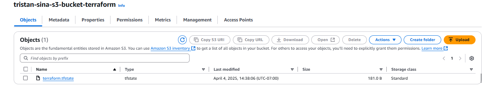
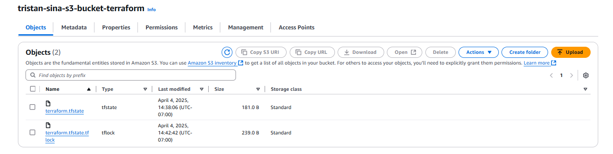

## Tristan James Torres: A01331949 
## Sina Abbasnia: A01377364
#### When is the state file created?  
- After running terraform apply and entering yes once prompted ```terraform.tfstate ``` is created inside the S3 bucket
#### When is the lock file present?
- After running terraform apply before saying yes inside the S3 bucket

#### Is the lock file always in the bucket after it is created?
- No, the lock file only exists during ```terraform apply```, it dissappears once the resources are created.